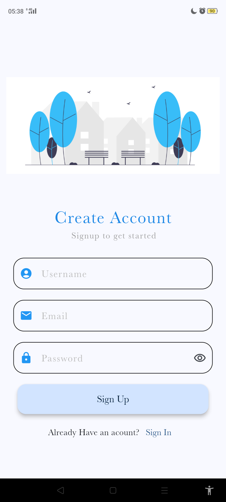
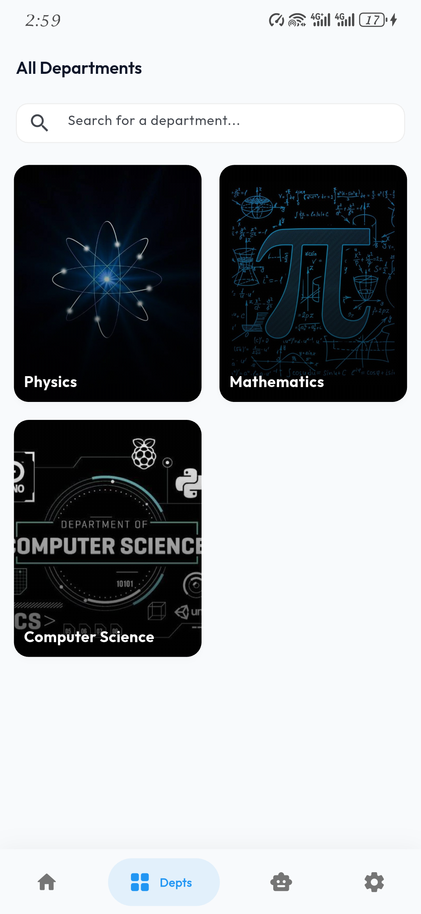
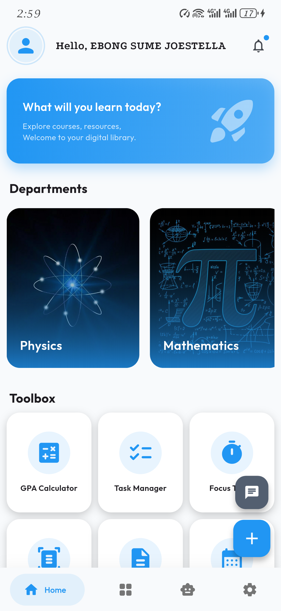
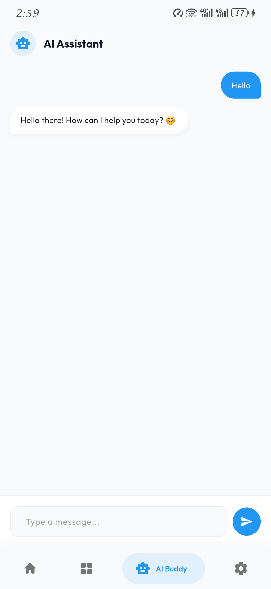

# Neo (Ub Studies) 🎓

[](https://flutter.dev)
[](https://supabase.com)
[](https://firebase.google.com)
[](https://deepmind.google/technologies/gemini/)

**Your comprehensive academic companion for Ub Studies.**

Neo is a modern, feature-rich Flutter application designed to empower students at Ub with tools for academic success, collaboration, and organization. From AI-driven study assistance to real-time chat and grade tracking, Neo brings everything a student needs into one sleek interface.

---

## ✨ Key Features

### 🧠 AI Academic Assistant
Leverage the power of **Google Gemini AI** to get instant answers to your academic queries, summarize complex topics, and get personalized study tips directly within the app.

### 📚 Course & Materials Management
- **Organization:** Keep track of all your courses and academic records in one place.
- **Resource Hub:** Access and view course materials (PDFs) with an integrated viewer.
- **Grade Tracking:** Monitor your performance and stay on top of your academic goals.

### 💬 Global Student Chat
Stay connected with your peers! Neo features a **Global Chat** powered by Supabase, enabling real-time communication, collaboration, and community building among students.

### 🔔 Smart Notifications
Stay informed with real-time alerts for:
- **Global Chat Messages**
- **Exam Schedules**
- **Focus Timer Alerts**
- **Task Deadlines**

### 📅 Tools & Productivity
- **Exam Scheduler:** Never miss an important date.
- **Focus Timer:** Optimize your study sessions using the built-in focus tools.
- **Task Manager:** Organize your daily academic tasks and set reminders.
- **News Feed:** Stay updated with the latest campus news and announcements.

---

## 🛠 Tech Stack

- **Frontend:** [Flutter](https://flutter.dev)
- **Backend:** [Supabase](https://supabase.com) (Authentication, Database, Real-time Chat)
- **AI Integration:** [Google Generative AI (Gemini)](https://ai.google.dev/)
- **Cloud Messaging:** [Firebase Cloud Messaging](https://firebase.google.com/docs/cloud-messaging)
- **Local Database:** [Shared Preferences](https://pub.dev/packages/shared_preferences) & [Flutter Secure Storage](https://pub.dev/packages/flutter_secure_storage)

---

## 🚀 Getting Started

### Prerequisites

Before you begin, ensure you have the following:
- [Flutter SDK](https://docs.flutter.dev/get-started/install) installed on your machine.
- A [Supabase](https://supabase.com/) account and project set up.
- A [Firebase](https://console.firebase.google.com/) project configured for push notifications.
- A [Google AI Studio](https://aistudio.google.com/) API key for Gemini.

### Installation

1.  **Clone the repository:**
    ```bash
    git clone https://github.com/your-username/Ub-Hub.git
    cd Ub-Hub
    ```

2.  **Install dependencies:**
    ```bash
    flutter pub get
    ```

3.  **Environment Setup:**
    Create a `.env` file in the root directory and add your credentials:
    ```env
    SUPABASE_URL=your_supabase_url
    SUPABASE_ANON_KEY=your_supabase_anon_key
    GEMINI_API_KEY=your_gemini_api_key
    NEWS_API_KEY=your_news_api_key
    ```

4.  **Firebase Configuration:**
    Add your `google-services.json` (Android) and `GoogleService-Info.plist` (iOS) files to the respective platform directories.

5.  **Run the app:**
    ```bash
    flutter run
    ```

---

## 📱 Screenshots

| Onboarding | Dashboard | AI Assistant | Chat |
|:---:|:---:|:---:|:---:|
|  |  |  |  |

---

## 🤝 Contributing

Contributions are welcome! Please feel free to submit a Pull Request.

## 📄 License

This project is licensed under the MIT License - see the [LICENSE](LICENSE) file for details.
